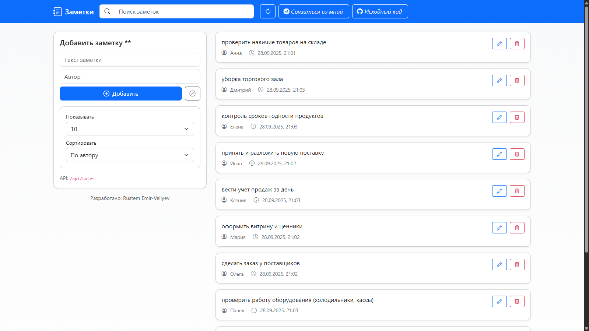
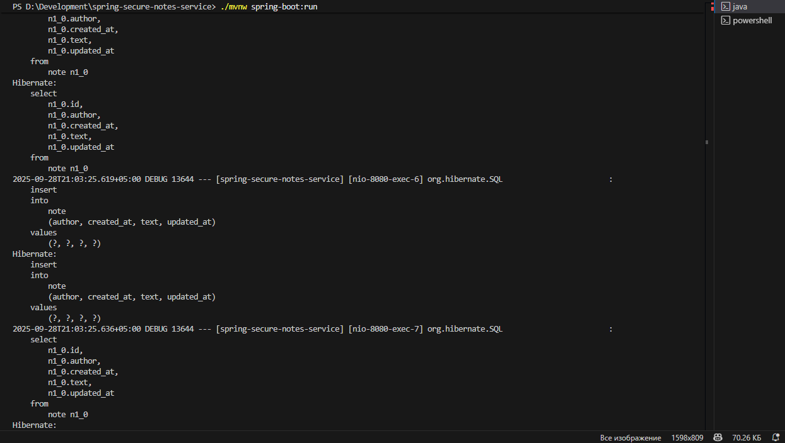
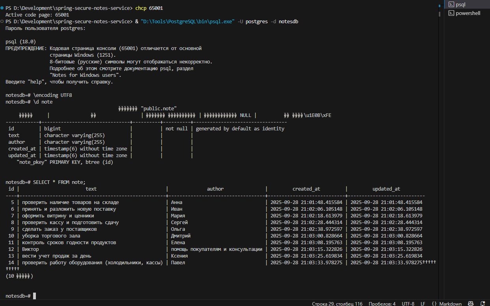
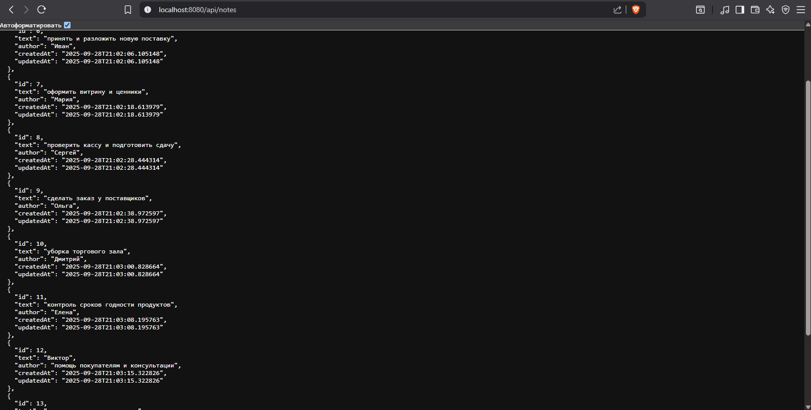

# Spring Secure Notes Service

**Дата:** 28.09.2025  
**Версия:** 1.0.0  
**Автор:** Rustem Emir-Veliyev  

Веб-приложение для создания и управления заметками.  
Проект написан на **Java 17 + Spring Boot + PostgreSQL**, с использованием **Thymeleaf** и **Bootstrap** для фронтенда.  

---

## Возможности
- Добавление заметок  
- Редактирование заметок  
- Удаление заметок  
- Хранение в PostgreSQL  
- REST API для интеграции (`/api/notes`)  

---

## Превью

### Веб-интерфейс


### Терминал (пример действий на сайте)


### База данных (psql)


### API (/api/notes)


---

## Установка и запуск

```bash
git clone https://github.com/emirveliyev/spring-secure-notes-service.git
cd spring-secure-notes-service
```

### 1. Настройка переменных окружения
Создайте файл **.env** (или пропишите в своей системе/терминале):
```
DB_USERNAME=postgres
DB_PASSWORD=ваш_пароль
```

### 2. Настройка PostgreSQL
```sql
CREATE DATABASE notesdb
    WITH OWNER = postgres
    ENCODING = 'UTF8'
    LC_COLLATE = 'ru_RU.UTF-8'
    LC_CTYPE = 'ru_RU.UTF-8'
    TEMPLATE = template0;
```

### 3. Запуск приложения
```bash
./mvnw spring-boot:run
```

Приложение будет доступно на [локальном хосте 8080](http://localhost:8080).

---

## REST API
- `GET /api/notes` — список всех заметок  
- `POST /notes/add` — добавить заметку  
- `POST /notes/update/{id}` — обновить заметку  
- `GET /notes/delete/{id}` — удалить заметку  

---

## Лицензия
MIT — см. [LICENSE](./LICENSE)